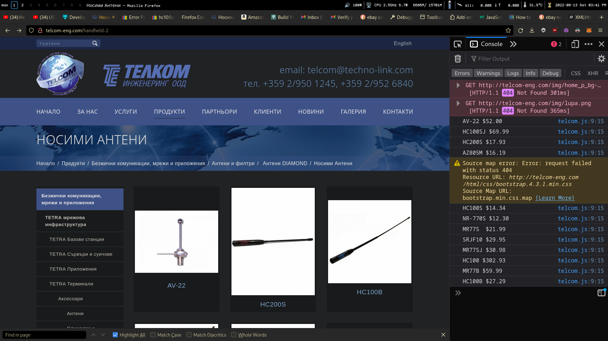

# telkom-price
### 💶💷💴💵💶💷💴💵
  
 

Browser extension(firefox only at the moment) which shows you a price estimation for products listed on [this website](http://telcom-eng.com/).

## Demo
   

## Usage
`1. Unzip the folder`
`2. Go to about:debugging in firefox > "This Firefox" > "Load Temporary Add-on" > select manifest.json`
 
## TODO
Migrated to [projects](https://github.com/confestim/telkom-price/projects).
